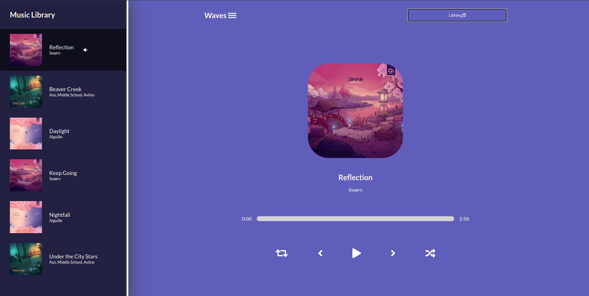

# Practice Repo

Repo to hold practice/learning projects and other code. \
Combined the projects into one React Project so that they can share the same Github Repo (practice-repo) URL.

## Projects
Recommended: Open links by right clicking and opening with new tab. 

### Waves Music App 
### 
**Live Site:** <a href="https://andrewjustinw.github.io/practice-repo/#/waves" target="_blank">Waves Music App</a> \
**Reason:** Created to become familiarized with react. 

---

### BookList App 
### 
**Live Site:** <a href="https://andrewjustinw.github.io/practice-repo/#/booklist" target="_blank">Booklist App</a> \
**Reason:** Created to practice using React's Context API. 

